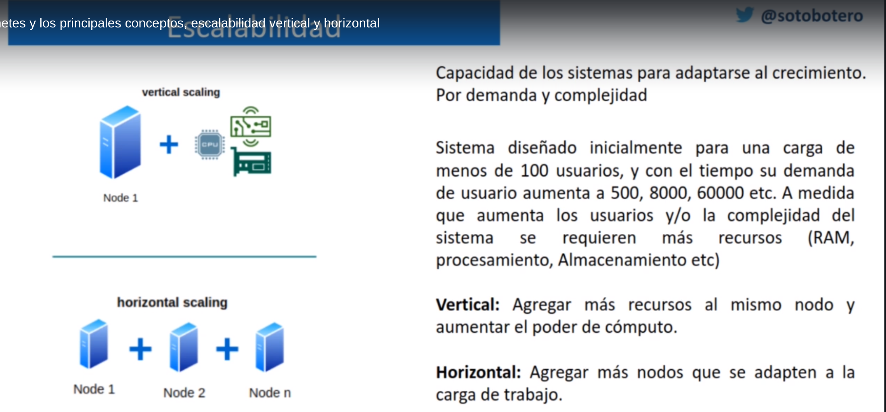
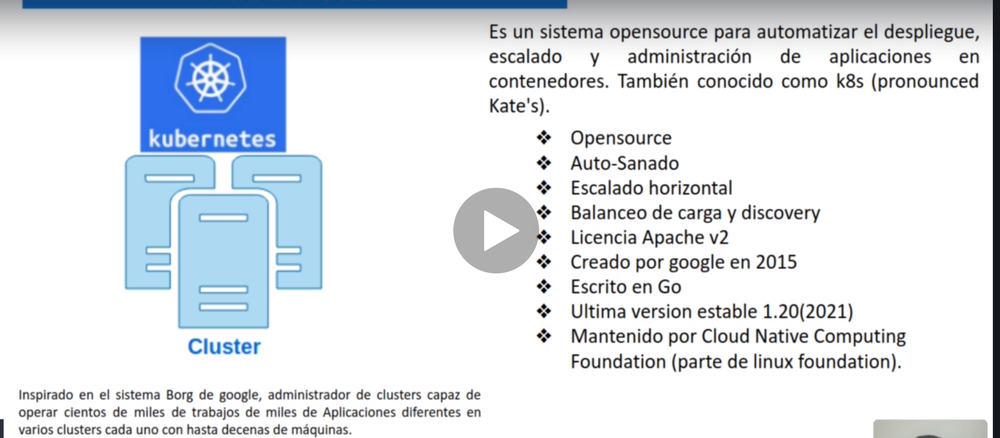
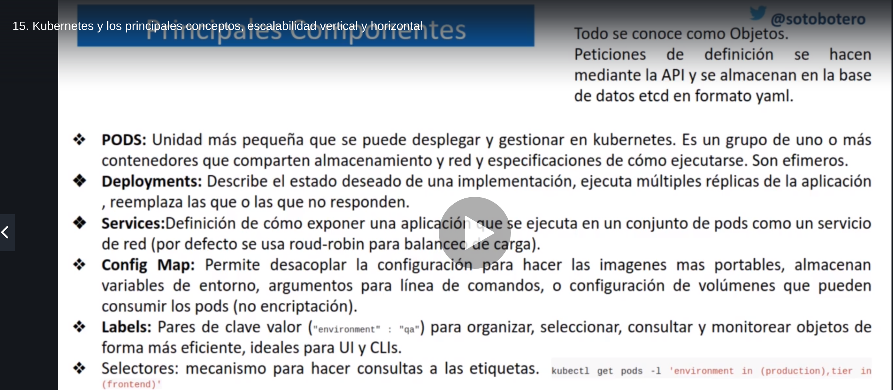

# Kubernetes principales conceptos

## Escalabilidad
El principal concepto de kubernetes es la **ESCALABILIDAD**, capacidad de los sistemas para adaptarse al crecimiento. Por demanda y complejidad.

Dos tipos de escalabilidad:
- **Vertical**: 1 solo nodo y se aumentan los recursos, peor opción por la limitación de de los recursos.
- **Horizontal**: Varios nodos

## Características

Kubernetes es un sistema open source que nos sirve para gestionar un cluster.
Un cluster está compuesto de varios nodos que tienen capacidad de computo.
Si ponemos a trabjaar varios nodos en conjunto ya estamos hablando de cluster

Un de las características más importantes es el **Auto-sanado**, las aplicaciones tienen la capacidad de recuperarse cuando detectan que algo está saliendo mal.

## Principales componentes

Todo lo que creamos son objetos. Definidos los objetos los enviaremos a través de la `API`de kubernetes y quedan almacenados.
`PODS`: Es el componenete más importante. Son las unidades más pequeñas que podemos descargar y gestionar en Kubernetes. Es un grupo de 1 o de más contenedores que comparten almacenamiento, red y especificaciones de como ejecutarse. Son efímeros, es aquí donde se ejecutan las aplicaciones.
`Deployments`: Se define como será la implementación, se define número de replicas de la aplicación.
`Services`: Lo que se le expone al usuario final a través de la red y normalmente se hace con alta disponibilidad.
`Config-map`: Son ficheros de configuración donde definimos varias cosas como variables de entorno... Son utilizadas por los PODS, no soportan encriptación por lo tanto no se pueden meter contraseñas.
`Labels`: Pares de clave valor, para organizar objetos.
`Selectores` Mecanismo para hacer consultas, queries.

